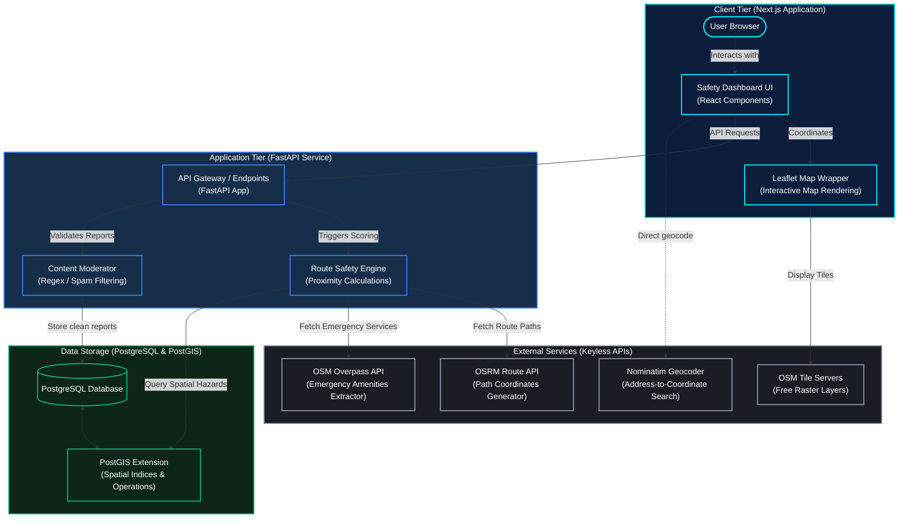

# SentinelPath AI

SentinelPath AI is a safety-focused college navigation platform designed to help pedestrians and students make safer routing choices. Unlike traditional mapping software that optimizes purely for speed or distance, SentinelPath AI calculates a **Safety Score (0–100)** for alternative routes and highlights the safest option—even if it is slightly longer.

---

## Key Features

- **Safety-First Routing Engine:** Pulls alternative routes from the open OSRM server, computes spatial hazard intersections, and recommends the safest path.
- **Explainable Scoring System:** Deducts or awards safety points dynamically based on:
  - Static NCRB baseline district-level risk values.
  - Active peer-submitted safety incident alerts within 200m of the route.
  - Nighttime hours adjustments (9 PM – 5 AM).
  - Proximity to emergency services (police stations and hospitals) within 300m.
- **Toggleable Safety Heatmap:** Visually overlays the map with precomputed grid blocks colored green (safe), amber (warning), or red (high risk) based on historical and live reports.
- **Anonymous Alert Submission:** Pin-drop maps interface allowing peers to report poor lighting, harassment, or suspicious activity, complete with regex-based spam/profanity filters.
- **Emergency Geolocation SOS Panel:** Tracks live coordinate shifts via browser Geolocation, queries the closest 4 safety services, and generates a WhatsApp share link.

---

## Technology Stack

- **Frontend:** Next.js (TypeScript, React) & Leaflet.js
- **Backend:** FastAPI (Python) & SQLAlchemy
- **Database:** PostgreSQL with PostGIS extension (geospatial query indexer)
- **APIs:** 
  - Standard OpenStreetMap tiles (Inverted to Dark Mode via CSS filter to maintain 100% free service without API keys).
  - Open Source Routing Machine (OSRM) Demo server.
  - OpenStreetMap Overpass QL API (Emergency services query engine).
  - OpenStreetMap Nominatim API (Search geocoder).

---

## System Architecture



---

## Installation & Setup

### Prerequisites
- Node.js (v18+)
- Python (v3.10+)
- Docker Desktop (active)

### 1. Database Configuration
SentinelPath AI relies on PostGIS for spatial indexing and calculations. Spin up the database container:
```bash
docker-compose up -d
```
*Note: This launches a local PostGIS container on port `5432`.*

---

### 2. Backend Setup
1. Navigate to the backend directory:
   ```bash
   cd backend
   ```
2. Setup the virtual environment and install packages:
   ```bash
   python -m venv venv
   # Windows:
   .\venv\Scripts\activate
   # Linux/macOS:
   source venv/bin/activate

   pip install -r requirements.txt
   ```
3. Load static NCRB crime data boundaries and tables:
   ```bash
   python seed_data/import_ncrb.py
   ```
4. (Optional) Populate the database with test incidents along Delhi's primary routes:
   ```bash
   python seed_data/seed_incidents.py
   ```
5. Run the FastAPI development server:
   ```bash
   uvicorn app.main:app --host 127.0.0.1 --port 8000 --reload
   ```

---

### 3. Frontend Setup
1. Navigate to the frontend directory:
   ```bash
   cd ../frontend
   ```
2. Install npm packages:
   ```bash
   npm install
   ```
3. Start the Next.js development server:
   ```bash
   npm run dev
   ```
4. Open the application in your browser: **[http://localhost:3000](http://localhost:3000)**
